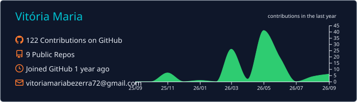
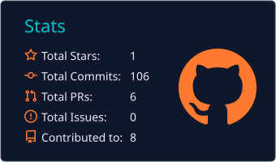
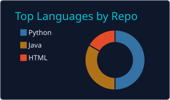

# Olá, eu sou a Vitória Maria 👋

### Estudante de Ciência da Computação | Desenvolvimento de Software e Dados

Construindo experiência em **programação, bancos de dados e organização de dados**, com foco atual no fortalecimento de **Python e SQL**.

  
  

---

## 👩‍💻 Sobre mim

Sou estudante de **Ciência da Computação na UniFECAF** e atualmente atuo como **Jovem Aprendiz na Global HITSS**, apoiando atividades relacionadas a projetos, controles e organização de informações.

Estou construindo gradualmente minha atuação técnica em TI, com interesse principalmente em **dados, bancos de dados e desenvolvimento de software**.

Durante minha formação, venho praticando programação, lógica, banco de dados, desenvolvimento web, versionamento e organização de projetos. Meu foco atual é consolidar os fundamentos que já estudei e aumentar minha autonomia para desenvolver e compreender soluções técnicas.

---

## 🎯 Atualmente desenvolvendo

  
  
  
  
  
  

### Outros conhecimentos e práticas

  
  
  
  
  
  

---

## 📂 Projetos e estudos selecionados

### 🎓 Core Study

Plataforma educacional iniciada como projeto acadêmico em equipe utilizando **Python e banco de dados**, originalmente executada pelo terminal.

Participei da **modelagem conceitual do banco de dados** e da reorganização da navegação em menus e submenus.

Posteriormente, conduzi individualmente uma evolução do projeto para Web, utilizando IA como apoio intensivo para implementar novas funcionalidades, interface e refinamentos a partir da base original.

  
  
  
  
  
  

➡️ [Ver Core Study](https://github.com/vitoriamaria-bp/core-study)

---

### 📊 Projeto Vendas

Conjunto de atividades acadêmicas utilizado para praticar **Python, SQL e MySQL**, incluindo consultas, relatórios e operações CRUD.

O repositório reúne exercícios envolvendo agregações, relacionamentos entre tabelas e integração entre Python e banco de dados.

  
  
  
  

➡️ [Ver Projeto Vendas](https://github.com/vitoriamaria-bp/projeto-vendas)

---

### 🛒 Cyber Setup

E-commerce demonstrativo criado como prática de desenvolvimento Web, com catálogo de produtos, busca, detalhes dos itens, carrinho persistido localmente e gerenciamento de produtos utilizando Firebase.

Também possui geração de pedido para envio pelo WhatsApp.

  
  
  
  

➡️ [Ver Cyber Setup](https://github.com/vitoriamaria-bp/cyber-setup-ecommerce)

---

## 🧰 Ferramentas e organização

### Versionamento e ambiente de desenvolvimento

  
  
  

Uso essas ferramentas em projetos pessoais e acadêmicos para versionamento, organização de repositórios, branches e colaboração.

### Metodologias e organização

  
  
  
  

Já utilizei esses recursos em projetos acadêmicos para planejamento, divisão de tarefas, acompanhamento do desenvolvimento e retrospectivas.

### Prototipação

  

Utilizado para criação e refinamento de interfaces e protótipos em atividades e projetos.

---

## 🤖 IA no meu processo de desenvolvimento

Utilizo ferramentas de inteligência artificial como apoio à **pesquisa, prototipação, compreensão de erros, revisão e desenvolvimento de projetos**.

A IA faz parte do meu processo de aprendizagem, e atualmente busco reduzir a distância entre aquilo que consigo construir com apoio dessas ferramentas e aquilo que consigo **entender, explicar, testar e desenvolver com autonomia**.

---

## 🎓 Formação

**Bacharelado em Ciência da Computação — UniFECAF**  
2026 — 2029 *(previsão de conclusão)*

---

## 📊 Estatísticas GitHub

  

---

## 📫 Contato

Busco oportunidades de **estágio em Tecnologia** que me permitam desenvolver experiência prática, aprofundar meus conhecimentos e contribuir em projetos reais.

[LinkedIn](https://www.linkedin.com/in/vitoria-maria-bezerra-pinheiro-439478217) • [E-mail](mailto:vitoriamariabezerra72@gmail.com)

